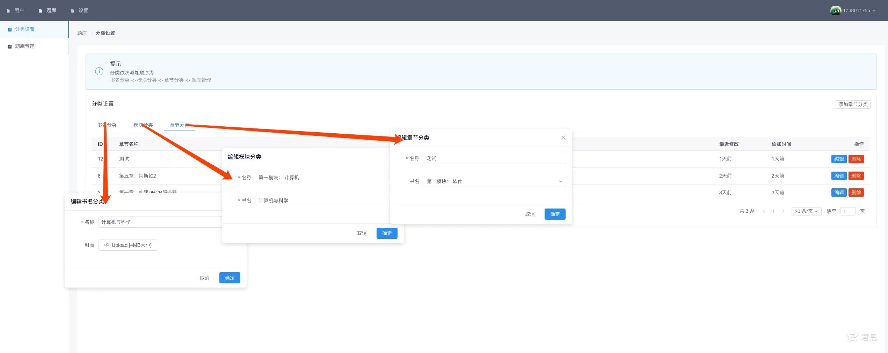

- <b>简体中文</b>
- [English]()

<p align="center">
    
</p>


本程序包含2部分，分别是：

> 这是一个 [前/后] 分离项目，这意味着您可以自由地在您的服务器上部署它。

* [前端UI *](https://github.com/vdjango/LessonForum)
* [后端 *](https://github.com/vdjango/LessonRestful)


优雅的开源 课程系统，现在，回应您的等待。

# 本部分为后端部分




课程系统 是一款能让您 管理 添加 修改 学员/积分 学员考试，学生，班级，课程等
, 于课程题库结合于一体的综合 Web 应用程序。

课程系统 是一个开源的 [Python] 项目，这意味着您可以自由地在您的服务器上部署它。当然，您可以继续完善它


环境要求
-----------
这对您的服务器有一定的要求

- 一台支持 URL 重写的主机，Nginx、Apache
- **django
- **uwsgi**
- pip3.6 install -r requirements.txt

自行构建
------------
如果你想为此项目作贡献，或者抢先尝试未发布的新功能，你应该先用 Git 上的代码部署。

**不推荐不熟悉 shell 操作以及不想折腾的用户使用。**

从 Git 上 clone 源码并安装依赖:

```bash
$ git clone ...
$ pip3.6 install -r requeirement.txt
$ python3.6 manage.py makemigrations
$ python3.6 manage.py migrate
$ python3.6 manage.py runserver
```

运行自动化测试（可跳过）：

```bash
$ python manage.py test
```

更多请参考Uwsgi部署方式

问题报告
------------
请提交lssues

版权
------------
Copyright (C) 2020 君思.

> 基于 GNU General Public License version 3 开放源代码的自由软件，你可以遵照 GPLv3 协议来修改或重新发布本程序。

